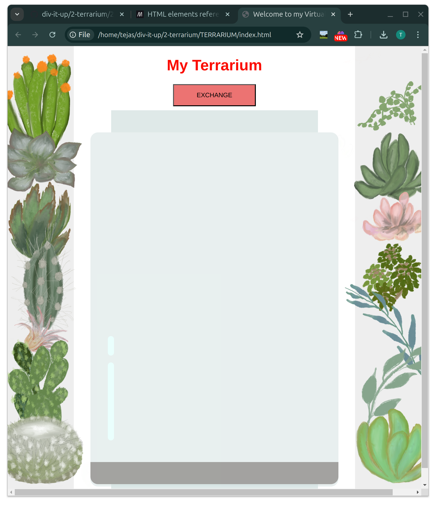
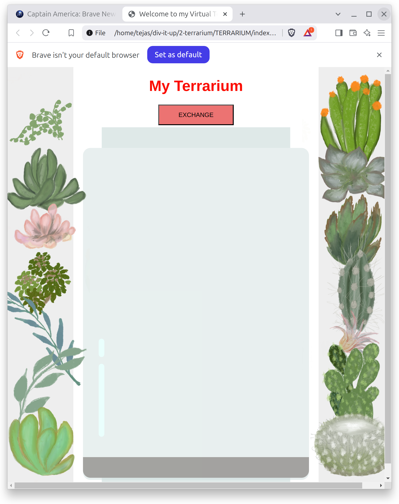
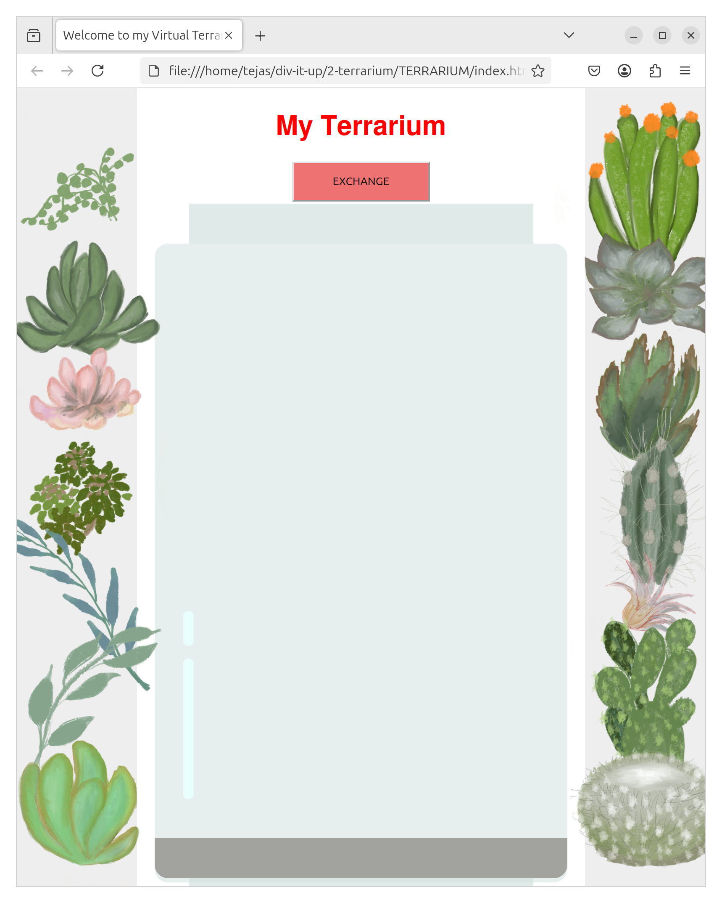

# 1. Sub Task 1
## Assignment
> File added in this directory. Name is mock_up(subtask-1 assignment)

## Challenge
> marquee is a tag used to make a text scroll in selected directions and also control actions when the text reaches the end of the scrolling.the next one i learnt was center tag which lets us to see the inline contents centered.font tag lets us edit size,color and face of the content in the line.

# 2. Sub Task 2

## Assignment
> In given options i have learnt flex box.i learnt about justify content, space around, space between; align-items,align-self :flex end,flex start,cente; flex-direction;flex-wrap;flex-flow  etc in it.
> screenshots are there in screenshots folder.
> chrome

> Brave

> Mozilla

##Challenge
> Added bubble shne to the left bottom of the jar.

# 3. Sub Task 3

## Assignment
> While researching about DOM I learnt a lot. First of all i learnt that it connects webpage(html) to scripts. I ran into node which is a building block or basic block of document structure.Every element,attributr, text in html is considered as a node. It has many interfaces like comment,node,eventTarget,document,documenType,element etc.In this I took Document interface. in the website i have seen most of the time documeen.getElementById(to select an element by its id given in html), .title(to set a title), .body(to access body element), .querySelector(to select first matching element),.head(to access head element) were used.

##Challenge
> I have added an exchange button which would change left container elements to right and vice versa.

